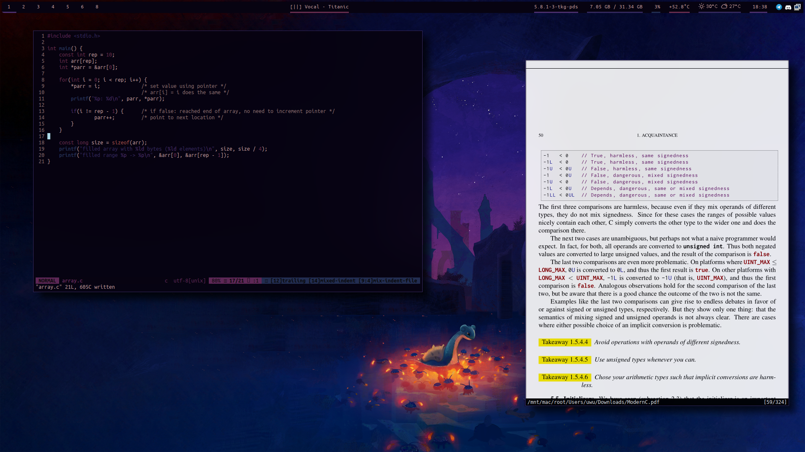

# dotsnew
my (hopefully) up to date i3-gaps dotfiles, now based around pywal and polybar.
also my terminal of choice is a slightly modified version of [luke smith's st fork](https://github.com/lukesmithxyz/st). maybe i'll share my exact config later.

## screenshot

(wallpaper art by [devin elle kurtz](https://www.patreon.com/devinellekurtz))

## configs for:
- i3-gaps wm
- polybar
- rofi
- fish
- compton
- neovim

## other supported software
make sure to set the 'DIR' variable in the wallpaper.sh script. if the script is located at ~/.local/src/scripts/wallpaper.sh, a simple 'wall' in the fish shell will change the wallpaper, generate a color scheme and apply it to some applications automatically.
- vs code with [xresources-theme](https://marketplace.visualstudio.com/items?itemName=JackVandergriff.xresources-theme)
- telegram with [telegram-palette-gen](https://github.com/agnipau/telegram-palette-gen)
- recommended to use [blurredfox theme](https://github.com/manilarome/blurredfox)

## key bindings
- standard i3 bindings for everything else
- mod+return open st
- mod+c close focused window
- jkl; changed to hjkl (vim keys)
- mod+d open rofi (execute)
- mod+shift+d open rofi-spotlight (global search)
- mod+y increase gaps by 5px
- mod+shift+y decrease gaps by 5px
- for st key binds, see [here](https://github.com/LukeSmithxyz/st/blob/master/README.md)

## installation
i recommend arch linux btw, for other non-arch (based) distros you have to figure the packages out yourself.
make sure that all the essentials are working on your install (like wifi), i won't address those here

required packages:
- i3-gaps
- polybar [aur]
- compositor like compton-tryone-git [aur]
- rofi
- feh
- python-pywal

recommended packages:
- [st](https://github.com/lukesmithxyz/st), also integrates perfectly with pywal. i recommend to clone the repo and change the config.h file to your liking - basically i would avoid the aur build
- [blurredfox firefox theme](https://github.com/manilarome/blurredfox)
- autotiling [aur]
- exa, bat, fish

step 1: install at least all the required packages, a terminal of your choice etc.

step 2: if you're not using st, change the line 'bindsym $mod+Return exec st' to your preferred terminal emulator.
also if you don't want to use autotiling, you have to delete the line 'exec_always --no-startup-id autotiling'. optionally set the 'DIR' variable in scripts/wallpaper.sh to your wallpaper directory and put the script in ~/.local/src/scripts/wallpaper.sh

step 3: copy the contents of the config folder to your own .config folder.
```
$ cp -r config/ ~/.config
```

step 4: profit
